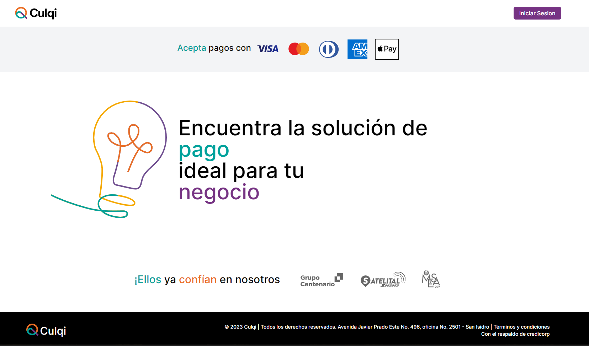
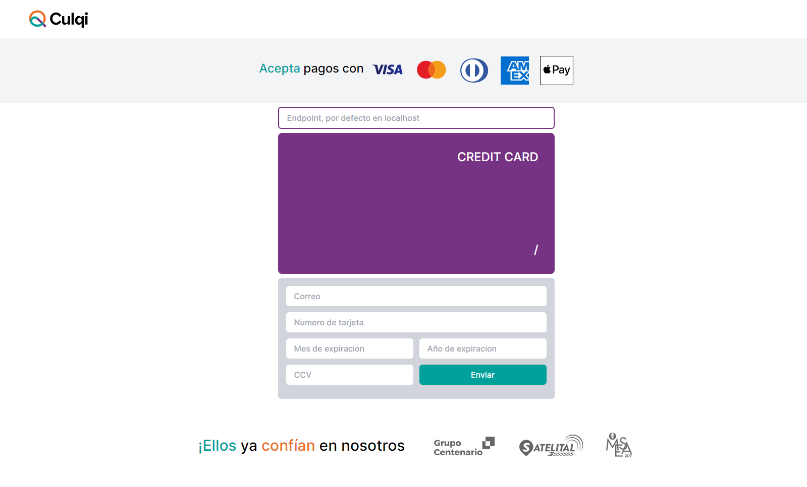

# Culqi test
El proyecto esta desarrollado con el framework "serverless", este necesita tener instalado y configurado la cli de amazon ("AWS CLI") para poder hacer el deploy en "lambda functions", adicionalmente el proyecto tiene 3 archivos .env (.env | .env.development | .env.prod) el primero se carga en cualquier escenario y los otros 2 dependen de si ejecutamos en un entorno local (development) o produccion (prod)

##
El archivo .env tradicional lleva las los datos del grupo de seguridad y las subnet mask y los otros 2 llevan la configuración para conectarse a las bases de dato (Redis). Dejo ejemplo de los 3 archivos.
### .env

```json
SECURITY_GROUP_ID="sg-0bd88f7f5ed7ac7c9"
SUBNET_IDS="subnet-0a0944384678645a4, subnet-07c467b0b34ee0dee, subnet-08e334420785b521d"
```

##
Para este caso he utilizado un cluster de ElastiCache para redis que se encuentra en la mism VPC que las funciones Lambda, pero se puede utilizar cualquier servidor de Redis, de hecho para el entorno local hay que tener instalado el servidor local de Redis o en todo caso indicar una URL diferente para conectarse:

### .env.development
```json
REDIS_URL="127.0.0.1"
```

### .env.prod
```json
REDIS_URL="culqi-redis.mi0af5.ng.0001.use2.cache.amazonaws.com"
```

## Ejecutar localmente
Despues de instalar las dependencias (npm install) lo unico que se debe hacer para probar el proyecto en un entorno local es:
```bash
npm run dev
```

## Desplegar a la nube
Para hacer el despliegue en la nube solo se debe correr el comando:
```bash
npm run deploy
```

## Test
Para ejecutar los test solo hay que correr el comando:
```bash
npm run test
```

# Frontend en VUE


El frontend en VUE trae los colores y el diseño de la pagina oficial de Culqi, la pantalla de inicio de sesion ofrece un boton para establecer las credenciales por defecto, cualquier otra conbinacion devolvera une error.
Una vez iniciada la sesion y despues de haber enviado correctamente los datos de la tarjeta al servidor, la aplicacion muestra una lista de los tokens generados en el servidor, solo basta con hacer click en alguno de ellos para recuperar los datos de la tarjeta.
Para probar el formulario solo hay que ingredar al directorio "frontend" y ejecutar el comando dev:
```bash
cd frontend
npm run dev
```
El formulario tiene un campo para establecer el endpoint, si no se especifica, por defecto hara las llamadas a localhost, para probar la API desde AWS hay que rellenar este campo con la url de la funcion lambda sin la ultima seccion, ejemplo.

```bash
https://uy7bdq5n2f.execute-api.us-east-2.amazonaws.com/prod/tokens
```
Recortar la ultima seccion para que quede de esta forma:
```bash
https://uy7bdq5n2f.execute-api.us-east-2.amazonaws.com/prod
```

Y eso seria todo, gracias.